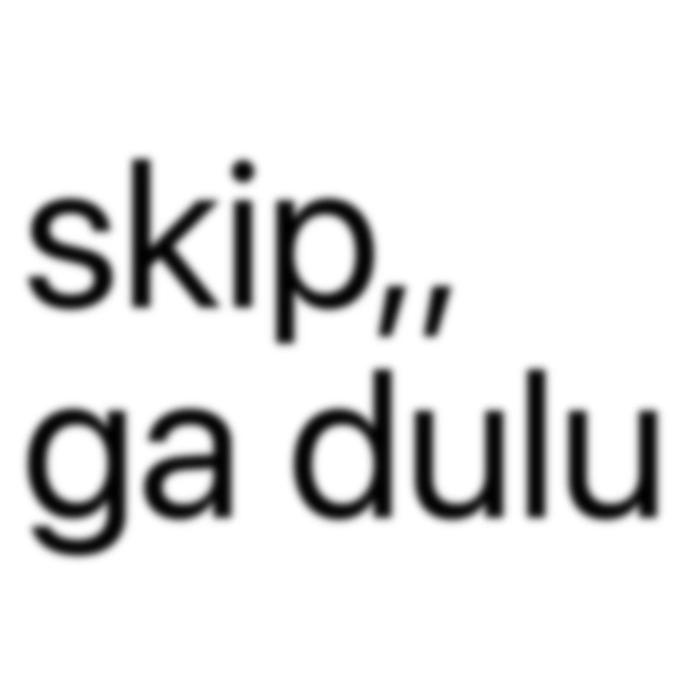

# brat text

Tiny brat-style text image generator. Type words, tune padding, copy or save the
result as a PNG.



## Use it

Open the app and type anything. The preview updates automatically.

You can also put text directly in the URL:

```text
https://bratt.netlify.app/skip,,+ga+dulu
```

That is enough. The app converts the path into editable text, so it opens with:

```text
skip,, ga dulu
```

Regular query links work too:

```text
https://bratt.netlify.app/?text=skip,,+ga+dulu
```

## Why it is handy

- No upload, login, or setup.
- URLs are shareable text prompts.
- `Copy` puts the generated image on your clipboard.
- `Save` downloads a PNG.
- `Link` copies a shareable URL.
- `Padding` controls how close text gets to the edge; smaller padding makes the
  text larger and more edge-to-edge.

## Local development

Install dependencies:

```bash
npm install
```

Run locally:

```bash
npm run dev
```

Build:

```bash
npm run build
```

Lint:

```bash
npm run lint
```

## Analytics

Set `VITE_GA_MEASUREMENT_ID` to enable GA4. Without it, analytics stays off.

```bash
cp .env.example .env.local
```

Then set:

```text
VITE_GA_MEASUREMENT_ID=G-XXXXXXXXXX
```

GA4 tracks page views for visit estimates. The app also sends `download_image`
when someone saves a PNG. Typed text is not sent.
